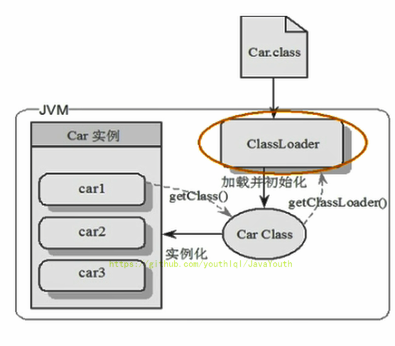
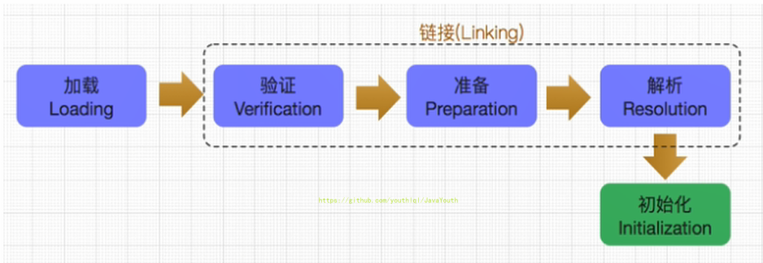

# 第2章-类加载子系统

## 内存结构概述

### 简图

### 

### 详细图


注意：方法区只有HotSpot虚拟机有。

如果自己想手写一个Java虚拟机的话，主要考虑哪些结构呢？

类加载器、执行引擎

## 类加载器子系统

类加载器子系统的作用

1. 类加载器子系统负责从文件系统或者网络中加载Class文件，class文件在文件开头有特定的文件标识
2. ClassLoader只负责class文件的加载，至于他是否可以运行，则有Execution Engine（执行引擎）决定。
3. **加载的类信息存放于一块称为方法区的内存空间**。除了类的信息外，方法区中还会存放运行时常量池信息，可能还包括字符串字面量和数字常量（这部分常量信息是Class文件中常量池部分的内存映射）


## 类加载器ClassLoader角色

1. class file（在下图中就是Car.class文件）存在于本地硬盘上，可以理解为设计师画在纸上的模板，而最终这个模板在执行的时候是要加载到JVM当中来根据这个文件实例化出n个一模一样的实例。
2. class file加载到JVM中，被称为DNA元数据模板（在下图中就是内存中的Car Class），放在方法区。
3. 在.class文件–>JVM–>最终成为元数据模板，此过程就要一个运输工具（类装载器Class Loader），扮演一个快递员的角色。



## 类加载过程

### 概述

```java
public class HelloLoader {

    public static void main(String[] args) {
        System.out.println("谢谢ClassLoader加载我....");
        System.out.println("你的大恩大德，我下辈子再报！");
    }
}
```

它的加载过程是怎么样的呢?

- 执行 main() 方法（静态方法）就需要先加载main方法所在类 HelloLoader
- 加载成功，则进行链接、初始化等操作。完成后调用 HelloLoader 类中的静态方法 main
- 加载失败则抛出异常


完整的流程图如下所示：



